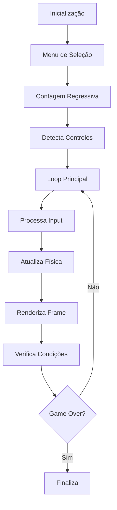

# Documentação do Pac-Man

Esta documentação fornece informações detalhadas sobre o jogo Pac-Man implementado em Python com pygame.

## Índice

- [Visão Geral](#visão-geral)
- [Instalação](#instalação)
- [Como Jogar](#como-jogar)
- [Controles](#controles)
- [Arquitetura](#arquitetura)
- [Desenvolvimento](#desenvolvimento)
- [Solução de Problemas](#solução-de-problemas)

## Visão Geral

O Pac-Man é um jogo clássico de arcade onde o jogador controla o Pac-Man através de um labirinto, coletando pontos e evitando fantasmas. Esta implementação inclui:

- ✅ Sistema de controles completo (teclado + Xbox/genéricos)
- ✅ Sistema de menu e seleção de modo
- ✅ Suporte a múltiplos jogadores (Player 1, 2, 3)
- ✅ Contagem regressiva antes do início
- ✅ IA dos fantasmas com diferentes comportamentos
- ✅ Sistema de pontuação e vidas
- ✅ Modo inofensivo (power pellets)
- ✅ Animações fluidas
- ✅ Detecção automática de controles

## Instalação

### Pré-requisitos

- Python 3.7 ou superior
- pip (gerenciador de pacotes Python)

### Passos de Instalação

1. **Clone ou baixe o projeto**
   ```bash
   git clone <url-do-repositorio>
   cd pacman
   ```

2. **Crie um ambiente virtual (recomendado)**
   ```bash
   python -m venv .venv
   source .venv/bin/activate  # Linux/Mac
   # ou
   .venv\Scripts\activate     # Windows
   ```

3. **Instale as dependências**
   ```bash
   pip install -r requirements.txt
   ```

4. **Execute o jogo**
   ```bash
   python main.py
   ```

## Como Jogar

### Início do Jogo
1. **Seleção de Modo**: Escolha entre Player 1, 2 ou 3
2. **Contagem Regressiva**: Aguarde 2 segundos para o jogo iniciar
3. **Controles**: Use os controles específicos do modo selecionado

### Objetivo
Colete todos os pontos (dots) no labirinto enquanto evita os fantasmas. Coma power pellets para tornar os fantasmas temporariamente inofensivos.

### Mecânicas
- **Pontos**: Colete dots para ganhar pontos
- **Power Pellets**: Torne os fantasmas inofensivos temporariamente
- **Vidas**: Você tem 5 vidas - perde uma ao tocar um fantasma
- **Túneis**: Use os túneis laterais para escapar dos fantasmas

### Pontuação
- **Dot**: 1 ponto
- **Power Pellet**: 5 pontos
- **Fantasma inofensivo**: 10 pontos

## Controles

### Teclado
- **WASD** ou **Setas**: Mover
- **R**: Reiniciar
- **ESC**: Sair

### Controles Xbox/Genéricos
- **D-pad/Analógico**: Mover
- **Start**: Reiniciar
- **ESC** (teclado): Sair

> 📖 [Documentação completa de controles](controles.md)

## Arquitetura

### Estrutura do Projeto
```
pacman/
├── main.py              # Ponto de entrada
├── src/
│   ├── game.py          # Lógica principal do jogo
│   ├── constants.py     # Constantes e configurações
│   ├── controller.py    # Sistema de controles
│   └── menu.py          # Sistema de menu e seleção
├── img/                 # Sprites e imagens
├── docs/                # Documentação
└── requirements.txt     # Dependências
```

### Componentes Principais

#### 1. Classe PacMan (`src/game.py`)
- Gerencia o loop principal do jogo
- Controla física e colisões
- Renderiza gráficos e UI

#### 2. Sistema de Controles (`src/controller.py`)
- Detecta controles automaticamente
- Mapeia botões para ações
- Suporta múltiplos tipos de controle

#### 3. Sistema de Menu (`src/menu.py`)
- Menu de seleção de modo
- Navegação intuitiva
- Suporte a múltiplos jogadores

#### 4. Constantes (`src/constants.py`)
- Configurações do jogo
- Mapa do labirinto
- Valores de pontuação

### Fluxo do Jogo



## Desenvolvimento

### Configurações de Desenvolvimento

#### FPS e Performance
- **FPS**: 60 (configurável em `constants.py`)
- **Escala**: 16 (tamanho dos sprites)
- **Zona morta**: 0.3 (analógicos)

#### Personalização

**Alterar dificuldade:**
```python
# Em constants.py
SPRITE_SPEED = 2  # Velocidade dos sprites
HARMLESS_MODE_DURATION = 16  # Duração do modo inofensivo
```

**Modificar mapa:**
```python
# Em constants.py - GAME_MAP
# Use: '#' para paredes, '.' para dots, 'o' para power pellets
```

### Adicionando Novos Recursos

1. **Novos tipos de controle**: Modifique `ControllerType` em `controller.py`
2. **Novos sprites**: Adicione imagens na pasta `img/`
3. **Novas mecânicas**: Estenda a classe `PacMan` em `game.py`

## Solução de Problemas

### Problemas Comuns

#### Controle não detectado
- Verifique se está conectado via USB/Bluetooth
- Teste em outros jogos
- Reinicie o jogo após conectar

#### Performance baixa
- Reduza o FPS em `constants.py`
- Verifique se há outros programas pesados rodando

#### Sprites não carregam
- Verifique se a pasta `img/` existe
- Confirme se os arquivos de sprite estão presentes

### Logs e Debug

O jogo não produz logs no console por padrão. Para debug:

1. Adicione prints temporários no código
2. Use um debugger Python
3. Verifique o feedback visual na tela

### Suporte

Para problemas específicos:
1. Verifique a [documentação de controles](controles.md)
2. Consulte os comentários no código
3. Teste com diferentes configurações

---

**Versão**: 1.2  
**Última atualização**: 2024  
**Compatibilidade**: Python 3.7+, pygame-ce 2.4.0+
